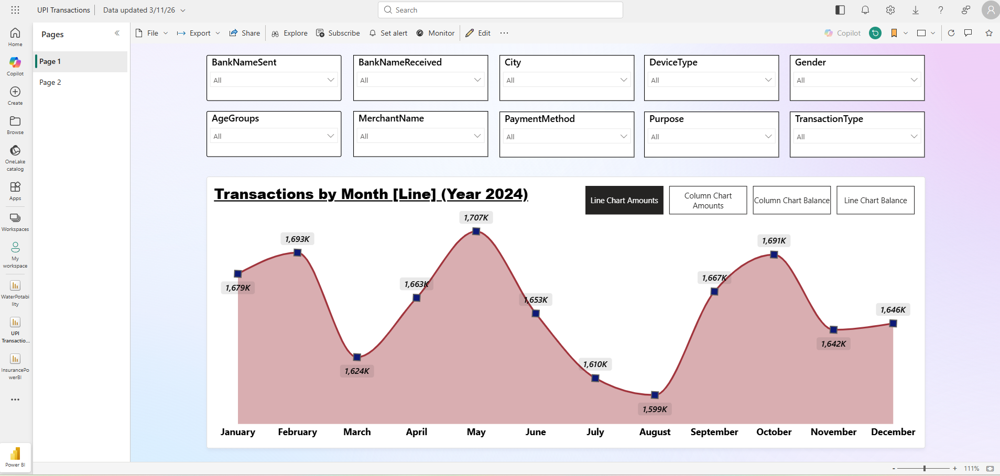
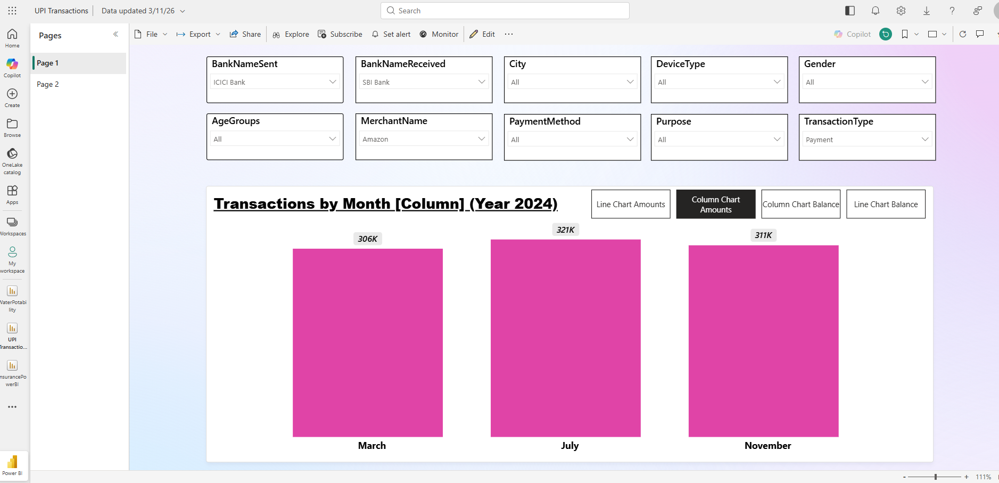

# Financial Transactions Dashboard

## Overview
Interactive dashboard built with Power BI for financial transaction analysis.

## Features
- Transaction monitoring
- Dynamic filters
- KPI indicators
- Comparative analysis

## Tools Used
- Power BI
- Data modeling
- Visual analytics

## Screenshots

### Main Dashboard

### Filters View

